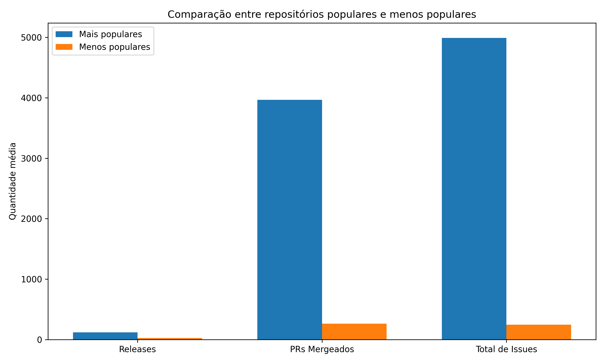
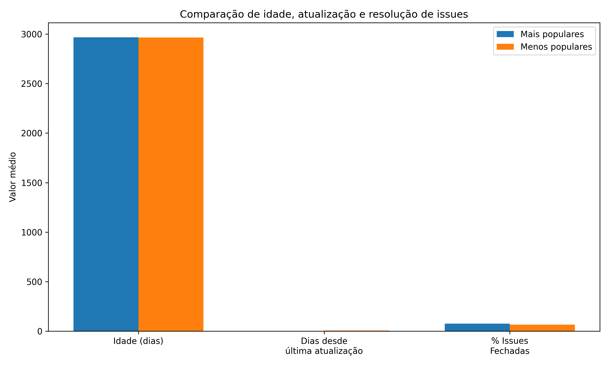

# Laboratório 01 – Características de Repositórios Populares

## Introdução

### Contextualização

Plataformas de hospedagem de código como o GitHub concentram milhões de projetos de software open source. Alguns desses projetos se destacam por possuir grande número de estrelas, indicando maior visibilidade e popularidade dentro da comunidade de desenvolvedores.

A análise desses repositórios permite compreender padrões de evolução, colaboração e manutenção em projetos de software open source. Esses padrões são importantes para entender como projetos bem-sucedidos são mantidos e como comunidades contribuem para sua evolução.

---

### Problema foco do experimento

Apesar da popularidade de muitos projetos open source, ainda é necessário compreender melhor como esses repositórios evoluem ao longo do tempo, especialmente em relação a:

* frequência de releases
* contribuição externa
* gerenciamento de issues
* frequência de atualização
* tecnologias utilizadas

---

### Questões de Pesquisa

**RQ01:** Sistemas populares são maduros ou antigos?

**RQ02:** Sistemas populares recebem muita contribuição externa?

**RQ03:** Sistemas populares lançam releases com frequência?

**RQ04:** Sistemas populares são atualizados com frequência?

**RQ05:** Sistemas populares são escritos nas linguagens mais populares?

**RQ06:** Sistemas populares possuem um alto percentual de issues fechadas?

---

### Hipóteses

**H1:** Repositórios populares tendem a ser mais antigos.

**H2:** Repositórios populares recebem mais contribuições externas.

**H3:** Projetos populares lançam releases com maior frequência.

**H4:** Projetos populares são atualizados mais frequentemente.

**H5:** Projetos populares utilizam linguagens amplamente adotadas.

**H6:** Projetos populares possuem maior percentual de issues resolvidas.

---

### Objetivo

#### Objetivo principal

Analisar características de repositórios populares no GitHub utilizando métricas obtidas via API GraphQL.

#### Objetivos específicos

* Coletar dados de repositórios populares
* Comparar repositórios mais populares e menos populares
* Identificar padrões de contribuição e manutenção
* Avaliar métricas de releases, issues e pull requests

---

# Metodologia

## Procedimento experimental

1. Utilização da API GraphQL do GitHub para consulta de repositórios.
2. Definição de dois grupos de análise:

### Grupo 1 – Repositórios mais populares

1000 repositórios com:

```
stars > 2000
```

### Grupo 2 – Repositórios menos populares

1000 repositórios com:

```
stars entre 1000 e 2000
```

---

### Métricas coletadas

Para cada repositório foram coletados:

* número de releases
* pull requests mergeados
* total de issues
* issues fechadas
* linguagem principal
* idade do repositório
* dias desde a última atualização

---

### Ferramentas utilizadas

* Node.js
* GitHub GraphQL API
* Script JavaScript para coleta automatizada
* Arquivos CSV para armazenamento
* Python + Matplotlib para geração de gráficos

---

# Resultados Obtidos

## Repositórios mais populares

| Métrica                       | Média   |
| ----------------------------- | ------- |
| Releases                      | 120.30  |
| Pull Requests Mergeados       | 3967.40 |
| Total de Issues               | 4990.52 |
| Issues Fechadas               | 4347.04 |
| Idade do Repositório (dias)   | 2965.70 |
| Dias desde última atualização | 1.01    |
| Percentual de Issues Fechadas | 77.34%  |
| Linguagem mais frequente      | Python  |

---

## Repositórios menos populares

| Métrica                       | Média      |
| ----------------------------- | ---------- |
| Releases                      | 26.15      |
| Pull Requests Mergeados       | 264.56     |
| Total de Issues               | 245.95     |
| Issues Fechadas               | 190.69     |
| Idade do Repositório (dias)   | 2963.72    |
| Dias desde última atualização | 6.11       |
| Percentual de Issues Fechadas | 66.52%     |
| Linguagem mais frequente      | JavaScript |

---

# Visualização dos Resultados

## Comparação entre repositórios populares e menos populares

A Figura 1 apresenta uma comparação entre repositórios mais populares e menos populares considerando três métricas principais: número médio de releases, pull requests mergeados e total de issues.

Observa-se que repositórios populares apresentam valores significativamente maiores em todas as métricas analisadas, indicando maior atividade de desenvolvimento, maior participação da comunidade e maior volume de manutenção.



**Figura 1 – Comparação entre repositórios populares e menos populares considerando releases, pull requests mergeados e total de issues.**

A Figura 2 complementa a análise ao comparar a idade média dos repositórios, o número médio de dias desde a última atualização e o percentual médio de issues fechadas.

Os resultados mostram que os dois grupos possuem idade média bastante semelhante, o que sugere que o tempo de existência do projeto não é, por si só, um fator determinante para sua popularidade. Por outro lado, os repositórios mais populares apresentam atualizações mais frequentes e um percentual maior de issues fechadas, indicando manutenção mais ativa e maior capacidade de resposta aos problemas reportados.



**Figura 2 – Comparação entre repositórios populares e menos populares considerando idade média, dias desde a última atualização e percentual de issues fechadas.**

# Discussão dos Resultados

### RQ01 – Sistemas populares são maduros?

A idade média dos dois grupos é semelhante (~8 anos). Portanto, a idade não parece ser um fator determinante para popularidade.

---

### RQ02 – Contribuições externas

Repositórios populares possuem aproximadamente **15 vezes mais pull requests**.

Hipótese confirmada.

---

### RQ03 – Frequência de releases

Projetos populares possuem **4,6 vezes mais releases**.

Hipótese confirmada.

---

### RQ04 – Frequência de atualização

Projetos populares apresentam atualizações praticamente diárias.

Hipótese confirmada.

---

### RQ05 – Linguagens

Python e JavaScript aparecem como linguagens predominantes.

Hipótese confirmada.

---

### RQ06 – Issues fechadas

Projetos populares possuem maior taxa de resolução de issues.

Hipótese confirmada.

---

# Insights

Principais descobertas:

* projetos populares recebem muito mais contribuições externas
* possuem ciclos de releases mais ativos
* apresentam manutenção mais eficiente
* são atualizados com maior frequência

Esses fatores sugerem que a popularidade de projetos open source está associada à **atividade da comunidade e manutenção ativa**.

---

# Conclusão

Os resultados indicam que projetos populares no GitHub apresentam maior atividade de desenvolvimento, maior participação da comunidade e manutenção mais eficiente.

A popularidade parece estar relacionada a um ciclo positivo: projetos ativos atraem contribuidores, que aumentam a atividade do projeto, o que por sua vez aumenta sua visibilidade e popularidade.

---

# Sugestões futuras

Possíveis extensões do experimento:

* analisar tempo médio de resolução de issues
* analisar número de contribuidores
* avaliar impacto da linguagem na popularidade
* investigar relação entre tamanho do projeto e popularidade

---

## Comparação com trabalhos relacionados

- **Raymond (2001)** afirma que projetos open source evoluem de forma mais dinâmica com colaboração aberta e feedback rápido. Isso se relaciona com os resultados deste trabalho, em que os repositórios mais populares apresentaram mais atividade e atualizações.

- **Tsay, Dabbish e Herbsleb (2014)** mostram que a aceitação de contribuições no GitHub envolve fatores técnicos e sociais. Isso complementa este estudo ao indicar que a atividade em repositórios populares também depende de processos de avaliação.

- **Di Cosmo e Zacchiroli (2017)** destacam que o código-fonte e seu histórico são essenciais para estudos empíricos em software. Isso reforça a importância das métricas utilizadas neste relatório.

De forma geral, os trabalhos analisados convergem ao indicar que a popularidade de repositórios open source está fortemente associada à atividade da comunidade, à frequência de evolução e à manutenção contínua. Assim, os resultados obtidos neste experimento se alinham à literatura ao mostrar que repositórios mais populares tendem a apresentar maior dinamismo e maior intensidade de colaboração e atualização.

## Referências

DI COSMO, Roberto; ZACCHIROLI, Stefano. Software Heritage: Why and How to Preserve Software Source Code. Paris: UNESCO, 2017.

GITHUB. GitHub GraphQL API Documentation. Disponível em: <https://docs.github.com/en/graphql>. Acesso em: 13 mar. 2026.

RAYMOND, Eric S. The Cathedral and the Bazaar. Sebastopol: O'Reilly Media, 2001.

TSAY, Jason; DABBISH, Laura; HERBSLEB, James. Influence of Social and Technical Factors for Evaluating Contribution in GitHub. In: INTERNATIONAL CONFERENCE ON SOFTWARE ENGINEERING (ICSE), 36., 2014. Proceedings [...]. New York: ACM, 2014.
